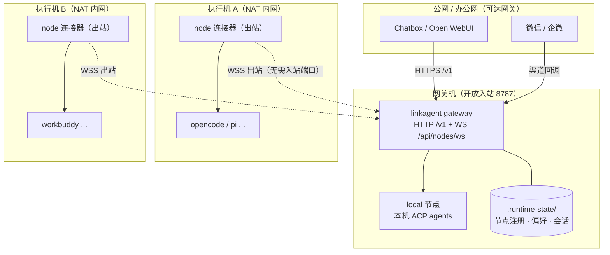
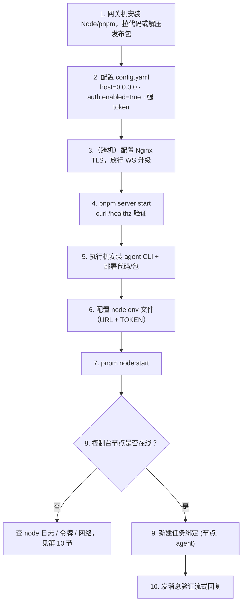

# LinkAgent 部署运维文档

> 适用版本：v0.1（网关—节点多机执行）
> 阅读对象：负责部署网关、接入执行节点、日常运维的工程师

---

## 1. 部署架构



**核心特征**：只有网关机需要开放入站端口；所有执行节点只发起**出站** WebSocket，
可藏在 NAT / 防火墙后，通过地址 + token 接入。

---

## 2. 环境要求

| 组件 | 要求 |
|---|---|
| Node.js | `>= 22.13` |
| 包管理 | pnpm `8.6.5`（corepack 自带） |
| 网关机 | 可被客户端与节点访问的 TCP 端口（默认 8787） |
| 执行机 | 已安装需要的 agent CLI（opencode / pi / workbuddy / trace-cli） |
| 操作系统 | macOS / Linux（启停脚本为 bash；Windows 用 `pnpm` 原生命令） |

---

## 3. 获取与安装

```bash
# 方式一：源码（开发 / 自托管）
git clone <repo> linkagent && cd linkagent
pnpm install
pnpm typecheck          # 可选：环境自检

# 方式二：独立部署包（GitHub Releases，三平台产物）
# 解压 linkagent-<版本>-<平台>-<架构>.tar.gz 后得到 dist/linkagent/
```

独立包本地构建：`pnpm build:dist`，产物在 `dist/linkagent/`。

---

## 4. 部署网关

### 4.1 配置

编辑 `backend/config/config.yaml`（或用环境变量 `GATEWAY_CONFIG_PATH` 指向自定义配置）：

```yaml
server:
  host: 0.0.0.0      # 需要被其它机器访问时用 0.0.0.0；仅本机用 127.0.0.1
  port: 8787
auth:
  enabled: true      # 跨机部署 / 公网强烈建议开启
  token: "请改成强随机串"   # 机器客户端（Chatbox）与节点连接器用的静态令牌（可留空）
  sessionTtlDays: 7  # Web UI 登录会话有效期（天），滑动续期
# tasks.defaultAgentId: pi
```

> 配置优先级：`GATEWAY_CONFIG_PATH` → `backend/config/config.yaml` → 内置默认值。

#### 4.1.1 两套凭据与登录账号

开启鉴权后存在多套并存的凭据：

| 凭据 | 用途 | 来源 |
|---|---|---|
| 静态 token（`auth.token`） | Chatbox / Open WebUI 的 `Authorization: Bearer`、节点连接器 `LINKAGENT_GATEWAY_TOKEN` | config.yaml 配置，留空则不启用 |
| 会话 token | Web 管理后台（浏览器）登录后自动携带 | 账号密码登录 `/api/auth/login` 签发 |
| 个人 API token（`pat_` 前缀） | 登录账号本人用 OpenAI 兼容客户端（Chatbox 等）以 `Authorization: Bearer pat_…` 直连 `/v1`，权限等同该账号 | 后台「我的 Token」自助获取/轮换/吊销，落盘 `.runtime-state/users/personal-tokens/` |
| 机器 token（`nt_` 前缀） | 节点连接器 `LINKAGENT_GATEWAY_TOKEN`（用户在后台「节点」页颁发，一机一证、归属该用户）；**不**授予 HTTP 管理权限 | 落盘 `.runtime-state/users/node-tokens/` |

- 首次**需要登录**的访问（token 模式，或 local 模式从非本机打开）且账号库为空时，生成随机管理员密码（用户名 **admin**），**仅本机回环的登录页与网关日志展示明文**，并落盘 `.runtime-state/users/admin-initial-password`（0600）；**首次登录强制改密**，改密后删除该文件；
- **local（本机）模式**：回环访问免登录、无需密码（浏览器里过期 token 也不挡）；
- 账号数据落盘 `.runtime-state/users/`（密码用 scrypt + 随机 salt 哈希，禁止明文）；
- admin 登录后可在后台「用户管理」新增/删除账号、重置密码（角色 `admin` / `user`）；
- 会话默认 7 天有效并滑动续期，退出登录或改密相关会话立即失效；
- 忘记 admin 密码：停止网关后删除 `.runtime-state/users/accounts/admin.json` 与 `admin-initial-password`（若有），下次需要登录时会重新生成。

### 4.2 启动方式

```bash
# 开发（watch 自动重启）
pnpm dev

# 前台直接运行
pnpm start

# 后台守护（推荐生产）：健康检查通过才报就绪
pnpm server:start
pnpm server:status
pnpm server:log
pnpm server:restart
pnpm server:stop
```

后台脚本 `scripts/server.sh` 写入：

- pid：`.runtime-state/server.pid`
- 日志：`.runtime-state/server.log`
- 就绪探测：`GET http://127.0.0.1:8787/healthz`

### 4.3 反向代理（WSS + HTTPS）

节点连接与 `/v1` 同端口，Nginx 需同时放行普通 HTTP 与 WebSocket 升级：

```nginx
server {
  listen 443 ssl;
  server_name gw.example.com;

  location / {
    proxy_pass http://127.0.0.1:8787;
    proxy_http_version 1.1;
    proxy_set_header Host $host;
    proxy_set_header Upgrade $http_upgrade;        # WS 升级
    proxy_set_header Connection "upgrade";
    proxy_read_timeout 3600s;                       # 长连接，避免 60s 断开
    proxy_set_header X-Forwarded-For $remote_addr;
  }
}
```

启用后节点地址填 `wss://gw.example.com`（连接器自动补 `/api/nodes/ws`）。

---

## 5. 部署执行节点

### 5.1 节点配置项

| 变量 / 参数 | 说明 | 默认 |
|---|---|---|
| `LINKAGENT_GATEWAY_URL` / `--gatewayUrl` | 网关地址，自动补全路径 | `ws://127.0.0.1:8787` |
| `LINKAGENT_GATEWAY_TOKEN` | 网关开启鉴权时填**网关静态 token 或用户颁发的 `nt_` 机器 token**；不填则匿名申请待审批 | 空 |
| `LINKAGENT_NODE_NAME` / `--name` | 控制台展示名 | `node-<hostname>` |
| `LINKAGENT_NODE_AGENTS` | 逗号分隔自报 agent | 内置 4 种 |
| `LINKAGENT_NODE_ID` | 一般不填，首次网关注发并持久化 | 自动 |
| `LINKAGENT_NODE_STATE_DIR` | 状态目录（多实例隔离用） | `.runtime-state/node` |

### 5.2 三种启动方式

```bash
# 1) 原生命令（最直接）
pnpm --filter @linkagent/backend node:connect \
  --gatewayUrl wss://gw.example.com --name builder-01
# 令牌用环境变量传入：
LINKAGENT_GATEWAY_TOKEN=xxx pnpm --filter @linkagent/backend node:connect

# 2) 前台脚本（开发）
pnpm node:dev
pnpm node:dev builder-01            # 命名实例

# 3) 后台守护（推荐）
pnpm node:start builder-01
pnpm node:status                    # 不带名字列出全部实例
pnpm node:status builder-01
pnpm node:log builder-01
pnpm node:restart builder-01
pnpm node:stop builder-01
```

### 5.3 用 env 文件固化配置（推荐）

后台脚本会自动加载 `.runtime-state/node[-<name>].env`（`KEY=VALUE`，每行一条），
避免令牌出现在命令行历史里：

```bash
# .runtime-state/node-builder-01.env
LINKAGENT_GATEWAY_URL=wss://gw.example.com
LINKAGENT_GATEWAY_TOKEN=请改成网关静态 token 或用户颁发的 nt_ 机器 token
LINKAGENT_NODE_AGENTS=opencode,pi
# LINKAGENT_NODE_NAME 不填时，命名实例自动用实例名 builder-01
```

随后 `pnpm node:start builder-01` 即可。

### 5.4 单机多实例

同一台机器可跑多个命名节点（例如模拟双节点、隔离不同 agent 环境）：

```bash
pnpm node:start n1
pnpm node:start n2
pnpm node:status
# 运行中  node-n1  pid=....
# 运行中  node-n2  pid=....
```

命名实例自动使用独立状态目录 `.runtime-state/node-<name>/`，
各自持有独立 `nodeId`，不会因共享身份被网关互相踢线。

---

## 6. 一键本机联调

网关与节点在同一台机器开发时：

```bash
pnpm dev:all                # 网关（若未运行则启动）+ 默认节点
pnpm dev:all n1             # 网关 + 命名节点
```

- 若 `8787` 健康检查已通过，则**复用**现有网关，退出时不停止它；
- 否则脚本自己拉起网关，Ctrl-C 时与节点一起退出；
- 节点配置同样读取 `.runtime-state/node[-<name>].env`。

---

## 7. 部署上线流程



---

## 8. 验证与验收

```bash
# 网关健康
curl -sS http://127.0.0.1:8787/healthz

# 节点列表（local 应置顶且在线，远程节点 online=true）
curl -sS http://127.0.0.1:8787/api/nodes | jq .

# 可路由 agent 扁平列表（建任务下拉数据源）
curl -sS http://127.0.0.1:8787/api/node-agents | jq .

# 控制台：浏览器打开 http://<网关>:8787/
#   - 节点管理区 5s 轮询，能看到在线/离线与自报 agent
#   - 建任务时节点 → agent 级联选择
```

一次 OpenAI 兼容调用（任务/渠道方式见 README）：

```bash
curl -sS http://127.0.0.1:8787/v1/chat/completions \
  -H 'Content-Type: application/json' \
  -d '{"model":"agent:pi","messages":[{"role":"user","content":"你好，你在哪台机器上？"}]}'
```

---

## 9. 运维手册

### 9.1 进程与日志位置

| 对象 | pid | 日志 |
|---|---|---|
| 网关 | `.runtime-state/server.pid` | `.runtime-state/server.log` |
| 节点（默认） | `.runtime-state/node.pid` | `.runtime-state/node.log` |
| 节点（命名） | `.runtime-state/node-<name>.pid` | `.runtime-state/node-<name>.log` |

### 9.2 节点生命周期与清理

- 节点断线：自动指数退避重连（2s→…→30s 上限），注册记录保留；
- 删除离线节点：控制台删除，或 `DELETE /api/nodes/:nodeId`（在线返回 `409`，`local` 返回 `400`）；
- 节点机如需**换新身份**，停止节点后删除其 `.runtime-state/node[-<name>]/node-id` 再启动。

### 9.3 开机自启（可选）

Linux 可用 systemd 托管（以独立包为例）：

```ini
# /etc/systemd/system/linkagent-gateway.service
[Unit]
Description=LinkAgent Gateway
After=network-online.target
[Service]
WorkingDirectory=/opt/linkagent
ExecStart=/usr/bin/pnpm start
Restart=always
RestartSec=3
[Install]
WantedBy=multi-user.target
```

节点同理，`ExecStart=/usr/bin/pnpm --filter @linkagent/backend node:connect`
并在 `EnvironmentFile=` 指向 env 文件。`systemctl enable --now` 生效。

### 9.4 升级

- 源码：`git pull && pnpm install`，然后 `pnpm server:restart`、各节点 `pnpm node:restart <name>`；
- 独立包：替换 `dist/linkagent/` 后重启；
- 节点先于/后于网关升级均可：断线期间任务返回 `node_offline`，重连后自动恢复。

---

## 10. 故障排查

| 现象 | 可能原因 | 处理 |
|---|---|---|
| 节点 upgrade 被拒 `401` | 令牌缺失/不一致 | 核对网关 `auth.token` 或用户颁发的 `nt_` 机器 token |
| 握手后被关（客户端常见 `1006`） | hello 内 token 校验失败 | 检查 env 文件是否加载、令牌是否含空格 |
| 升级返回 `404` | 路径错误 | 确认地址自动补 `/api/nodes/ws`，未被代理改写 |
| 节点反复「连接已关闭→重连」 | 多实例共用同一 `node-id` 被互踢 | 用命名实例（独立 `LINKAGENT_NODE_STATE_DIR`） |
| 控制台节点在线，任务却 `503 node_offline` | 任务绑定后节点掉线 | 恢复节点；绑定关系不变，上线即恢复 |
| `404 agent_unavailable` | 节点在线但未自报该 agent | 检查 `LINKAGENT_NODE_AGENTS` 与该机 CLI 安装 |
| WSS 每 60s 左右断开 | 代理空闲超时 | Nginx `proxy_read_timeout` 调大并正确转发 Upgrade |
| `pnpm node:stop` 后子进程残留 | 旧版按进程组停止 | 当前脚本递归回收进程树；可再 `pnpm node:stop <name>` |

快速定位命令：

```bash
pnpm node:status                         # 实例与 pid
pnpm node:log <name>                     # 跟随节点日志
tail -n 100 .runtime-state/server.log    # 网关侧上线/心跳/替换日志
```

---

## 11. 安全建议清单

- 跨机 / 公网部署务必 `auth.enabled: true` 并使用强随机 token；
- 部署后立即用默认 admin 登录后台并修改密码；按需为同事创建独立账号，不要共用 admin；
- 公网入口一律走 TLS（`wss://` / `https://`），令牌只放 env 文件或环境变量；
- 网关机 `host` 按需暴露，节点机**不要**开放任何入站端口；
- `.runtime-state/` 含会话与登录态（含密码哈希），注意文件权限，勿提交到代码库；
- 定期通过 Releases 更新，关注 `ci.yml` / `release.yml` 的产物校验。
