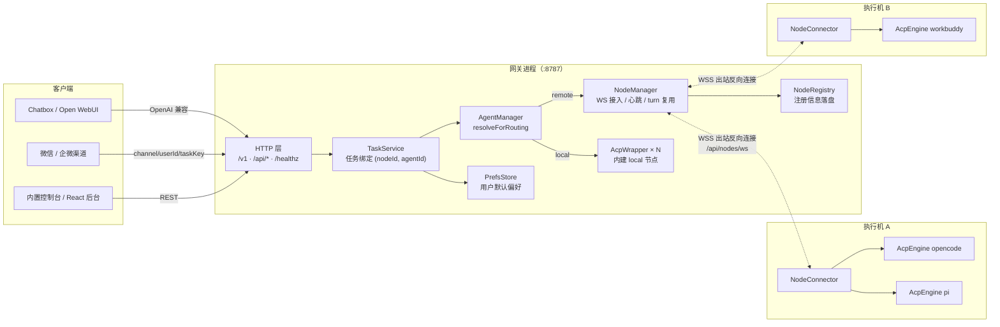
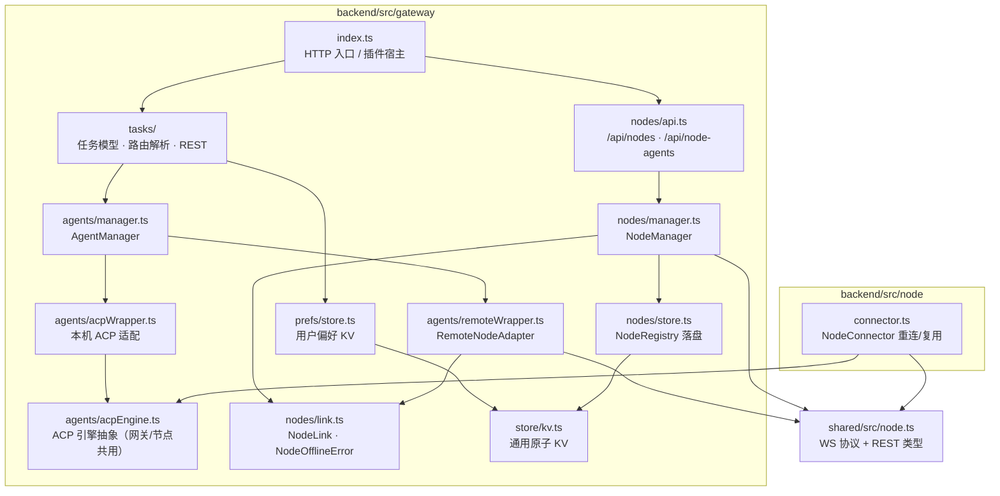
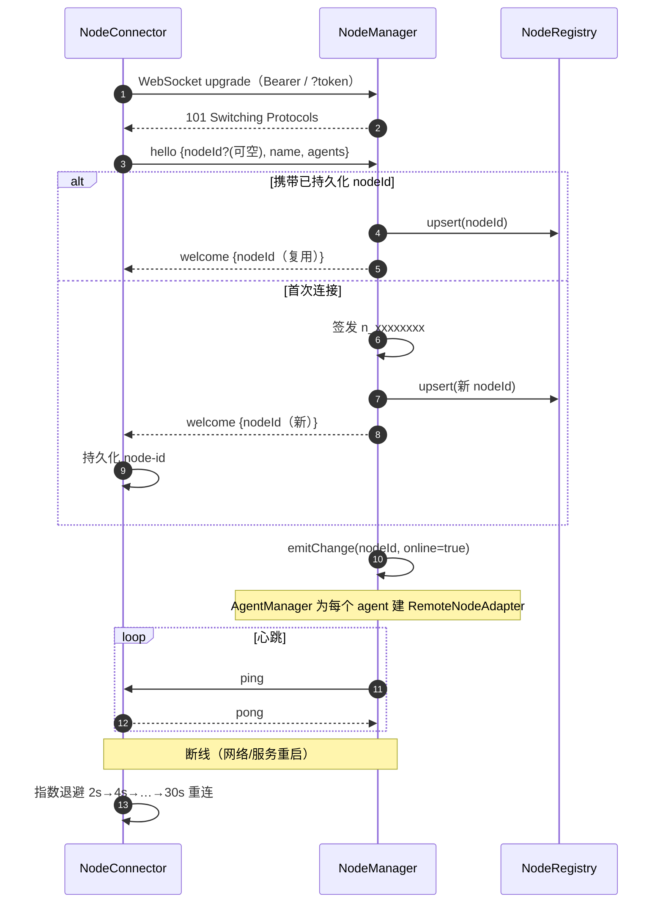
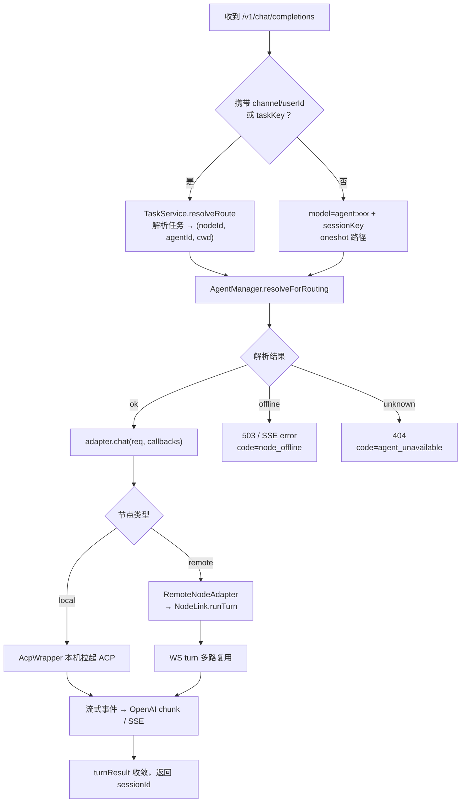
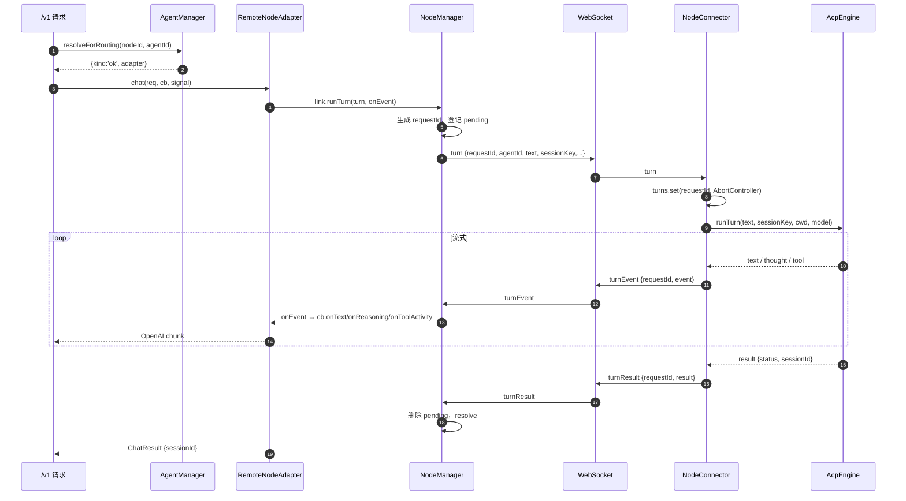
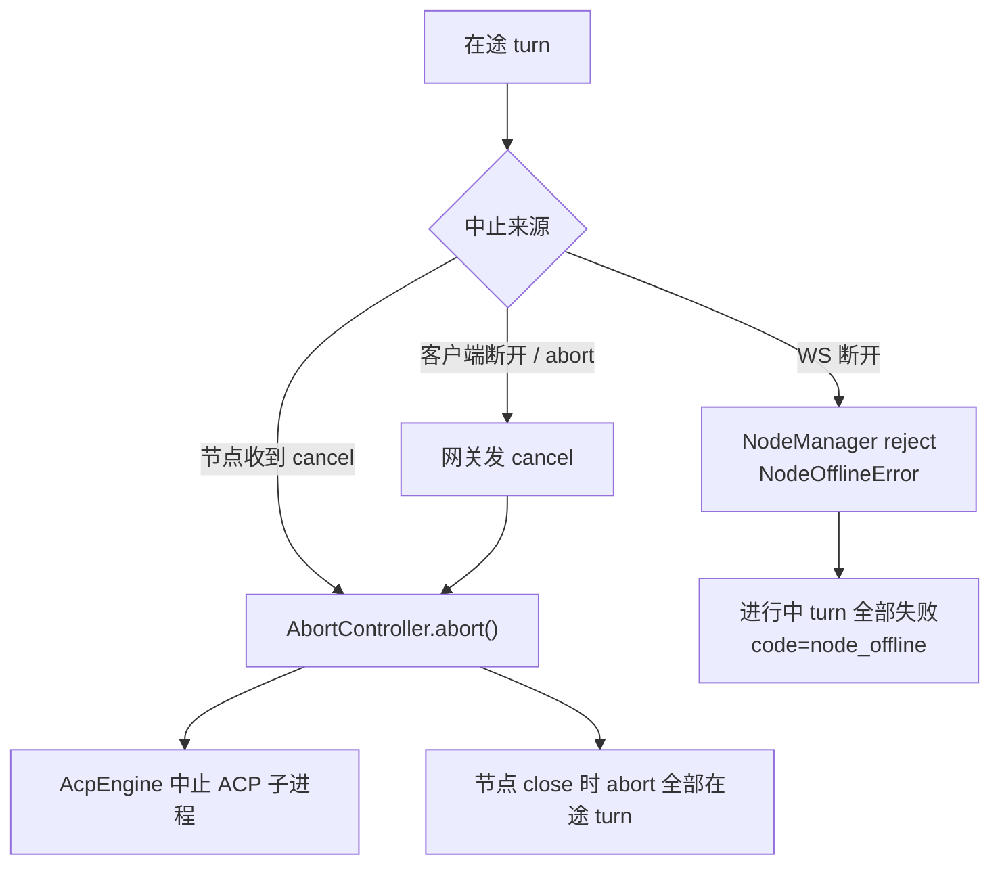
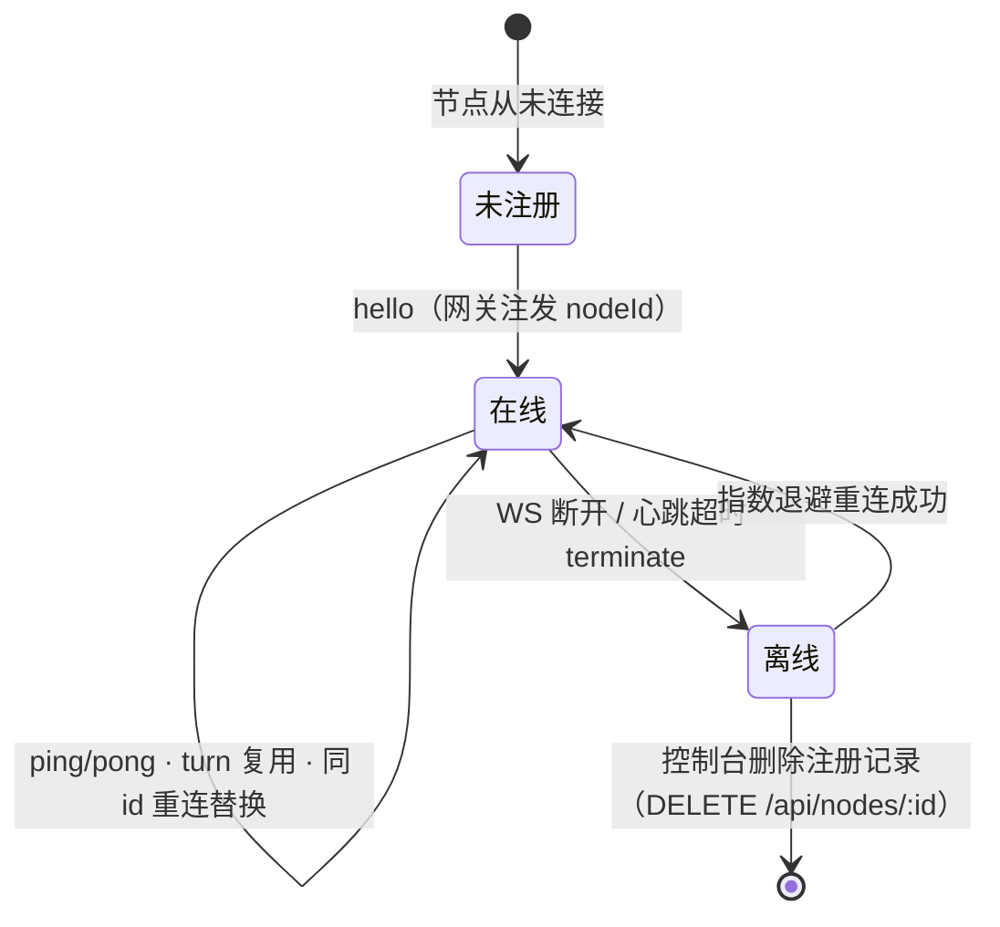

# LinkAgent 网关—节点 多机执行架构设计文档

> 版本：v0.1（对应多节点特性）
> 适用范围：网关（gateway）、远程节点连接器（node connector）、任务路由、节点管理与用户偏好
> 单一事实来源：节点协议类型定义见 `shared/src/node.ts`

---

## 1. 背景与目标

LinkAgent 是一个 OpenAI 兼容网关：Chatbox / Open WebUI / 微信渠道等客户端把对话发到网关，
网关把对话轮次交给底层 ACP agent（opencode / pi / workbuddy / trace-cli）执行。

最初 agent 只能在**网关本机**拉起。多节点特性要解决：

- agent CLI 安装在不同机器（如开发机、构建机、同事的 Mac），希望由一个统一网关调度；
- 执行机通常处于 NAT / 内网，**无法开放入站端口**；
- 任务需要固定在「某台机器 + 某个 agent」上执行，持久会话与工作目录都落在该机。

### 设计目标

1. **节点反向连接**：节点只发起出站 WebSocket，无需公网入站/端口映射。
2. **单连接多路复用**：一条 WS 承载多个并发 turn，用 `requestId` / `sessionKey` 关联。
3. **统一路由**：本机 agent 抽象为内建 `local` 节点，远程节点与本机在路由层完全对等。
4. **断线自愈**：节点断线自动指数退避重连；离线任务明确报错而不是静默漂移到别的机器。
5. **身份持久化**：节点首次由网关注册签发 `nodeId`，重连复用同一身份。

### 非目标（一期不做）

- 节点之间点对点通信 / 任务跨节点迁移；
- 节点侧鉴权多租户、ACL 细粒度授权；
- turn 负载均衡（一个任务固定绑定一个节点，不自动挑选）。

---

## 2. 系统架构

### 2.1 总体架构图

### 2.2 关键设计取舍

| 决策 | 选择 | 原因 |
|---|---|---|
| 连接方向 | 节点主动出站连网关 | 执行机在 NAT 内，免入站端口、免证书暴露 |
| 传输协议 | 单条 WebSocket + JSON 文本帧 | 天然双向、易穿透代理、浏览器/Node 均成熟 |
| 并发模型 | 单连接多请求，`requestId` 多路复用 | 避免每轮对话建连，复用 TLS 与握手 |
| 本机建模 | 内建 `local` 节点（`LOCAL_NODE_ID='local'`） | 路由逻辑只有一套，存量任务归一化到 local |
| 适配器 | `RemoteNodeAdapter implements AgentAdapter` | 远程 agent 与本机 agent 对上层同构 |
| 节点身份 | 网关注发 `n_xxx`，节点持久化 | 节点无需预置身份，重连不产生重复节点 |
| 离线策略 | 明确 `node_offline` 错误，不漂移 | 任务的会话/文件在指定机器，漂移会丢上下文 |

---

## 3. 模块职责

- **`NodeManager`**：WS 服务端。负责 upgrade 鉴权、hello 握手、心跳（ping/pong）、连接替换、
  turn 多路复用与超时、节点上下线事件广播、注册信息持久化。
- **`NodeRegistry`**：节点注册记录的 KV 落盘（`nodeId/name/agents/createdAt/lastSeenAt`），
  离线后记录保留，后台仍可见、可删除。
- **`AgentManager`**：订阅 NodeManager 的上下线事件。节点上线 → 为其每个自报 agent 创建
  `RemoteNodeAdapter`；下线 → 移除。对外提供 `resolveForRouting(nodeId, agentId)`。
- **`RemoteNodeAdapter`**：实现与本机 adapter 相同的 `AgentAdapter` 接口，内部把 `chat()`
  转成 `link.runTurn()`，把归一化流式事件映射回 `StreamCallbacks`。
- **`NodeConnector`**（节点侧）：出站连接、hello/welcome 握手、指数退避重连、
  按 `agentId` 懒创建 `AcpEngine`、按 `requestId` 维护 `AbortController`（支持 cancel / 断连中止）。

---

## 4. 通信协议

### 4.1 连接与鉴权

- 端点：`ws(s)://<gateway>/api/nodes/ws`（连接器会自动补全路径）。
- 令牌来源（任一）：
  1. upgrade query：`?token=<token>`；
  2. upgrade 头：`Authorization: Bearer <token>`；
  3. `hello` 消息体内 `token`（兜底）。
- 网关未开启鉴权时令牌可为空；开启后三者都不带/不匹配 → upgrade 阶段 `401`，
  或 hello 校验失败被服务端关闭（`4401 unauthorized`，客户端可能表现为 `1006`）。
- 非 `/api/nodes/ws` 路径升级 → `404`。

### 4.2 消息类型

| 方向 | type | 载荷要点 | 说明 |
|---|---|---|---|
| 节点→网关 | `hello` | `nodeId? name version agents[]{id,displayName?} token?` | 握手，复用身份或请求签发 |
| 网关→节点 | `welcome` | `nodeId` | 确认身份（新节点为新签发 id） |
| 网关→节点 | `ping` | — | 周期心跳探测 |
| 节点→网关 | `pong` | — | 心跳应答 |
| 网关→节点 | `turn` | `requestId agentId text model? cwd? sessionKey? permissionMode?` | 发起一轮 |
| 节点→网关 | `turnEvent` | `requestId event{kind:text/thought/tool}` | 流式增量 |
| 节点→网关 | `turnResult` | `requestId result{status,sessionId?,error?}` | 正常收敛 |
| 节点→网关 | `turnError` | `requestId message` | 执行异常 |
| 网关→节点 | `cancel` | `requestId` | 中止在途 turn |
| 网关→节点 | `closeSession` | `sessionKey` | 关闭持久会话（空闲回收） |

流式事件被收敛为三类，与传输解耦：`text`（正文）、`thought`（推理）、`tool`（工具名）。

### 4.3 握手与重连时序

### 4.4 同 nodeId 重连的连接替换

同一 `nodeId` 新连接握手成功时，网关关闭旧连接（`4000 replaced by new connection`）。
`onDisconnect` 用 **WebSocket 实例身份比对**，因此旧连接关闭不会误删新连接，避免抖动期的上下线翻转。

---

## 5. 一轮对话的端到端流程

### 5.1 请求处理流程

### 5.2 远程 turn 多路复用时序

### 5.3 取消与断线

---

## 6. 路由与任务绑定

### 6.1 路由解析三态

`resolveForRouting(nodeId, agentId)` 返回：

- `{kind:'ok', adapter}`：可执行；
- `{kind:'offline', nodeId}`：远程节点当前不在线 → `node_offline`；
- `{kind:'unknown'}`：local 未配置/停用，或在线节点未自报该 agent → `agent_unavailable`。

`nodeId` 为空时归一化为 `local`；存量无 `nodeId` 的任务在加载时一次性迁移到 `local`。

### 6.2 任务与偏好

- 任务绑定 `(nodeId, agentId)`，**绑定校验**只在「节点在线且已自报该 agent」时通过；
- 任务工作目录 `cwd` 落在执行节点（远程任务的文件操作发生在节点机）；
- 用户默认偏好（PrefsStore）仅用于控制台新建任务时**预填**节点/agent，不参与任何鉴权。

### 6.3 离线语义（不漂移）

| 场景 | 非流式 | 流式 SSE |
|---|---|---|
| 节点离线 | `503`，`code=node_offline` | 下发 `error` 事件后结束 |
| 在线但无该 agent | `404`，`code=agent_unavailable` | 同左 |
| local agent 停用/未配置 | `unknown` → 同上 | 同左 |

---

## 7. 状态与存储

运行时落盘位置（默认 `<repo>/.runtime-state/`）：

| 路径 | 内容 |
|---|---|
| `nodes/`（KV） | 节点注册记录（离线保留） |
| `node/node-id`（节点机） | 网关注发的身份，重连复用 |
| `node/acpx/<agentId>/`（节点机） | 各 agent 的 ACP 会话状态 |
| `acpx/`（网关机） | local 节点的 ACP 会话状态 |
| `prefs/`（KV） | 用户默认节点/agent 偏好 |

> 本机多实例：连接器支持 `LINKAGENT_NODE_STATE_DIR` 把身份与会话状态隔离开，
> 启动脚本对命名实例自动使用 `.runtime-state/node-<name>/`，避免多个实例共用一个 `node-id` 被网关互相替换。

---

## 8. 可靠性与容错

- **心跳**：网关周期 ping；连续未收到 pong 判定超时并 `terminate`，触发离线与在途 turn 失败。
- **重连**：节点指数退避（2s 起，上限 30s）；重连期间任务快速失败而非排队挂死。
- **hello 超时**：连接建立后限定时间内未完成握手则关闭。
- **在途清理**：WS close 时节点 abort 本机全部在途 turn；网关 reject 对应 Promise。
- **原子落盘**：通用 KV 采用原子写 + 损坏文件隔离，避免半截写坏全量状态。
- **事件回调隔离**：节点上下线监听器逐个 try/catch，单个订阅方异常不影响其它订阅方。

---

## 9. HTTP / REST 接口

| 方法 | 路径 | 说明 |
|---|---|---|
| GET | `/healthz` | 健康检查（启停脚本就绪探测） |
| GET | `/api/nodes` | 全部节点（local 置顶，含离线状态） |
| DELETE | `/api/nodes/:nodeId` | 删除离线注册（在线 `409`，local `400`） |
| GET | `/api/node-agents` | local + 在线节点的扁平可路由 agent 列表 |
| GET | `/api/users/:channel/:userId/preferences` | 读取用户默认偏好 |
| PUT | 同上 | 保存 `{nodeId, agentId}`（校验当前可路由） |
| POST | `/v1/chat/completions` | OpenAI 兼容对话（支持 `channel/userId/taskKey`） |

---

## 10. 可观测性与扩展点

- 节点列表暴露 `online / connectedAt / lastSeenAt / remoteAddress / agents / version`，
  控制台 5s 轮询刷新，聊天台对离线路由置灰并在发送前拦截。
- 扩展新 agent：在节点机安装对应 CLI 并加入 `LINKAGENT_NODE_AGENTS` 自报即可，无需改网关。
- 协议演进：`shared/src/node.ts` 为前后端/网关节点共享的唯一类型源，新增可选字段保持向后兼容。
