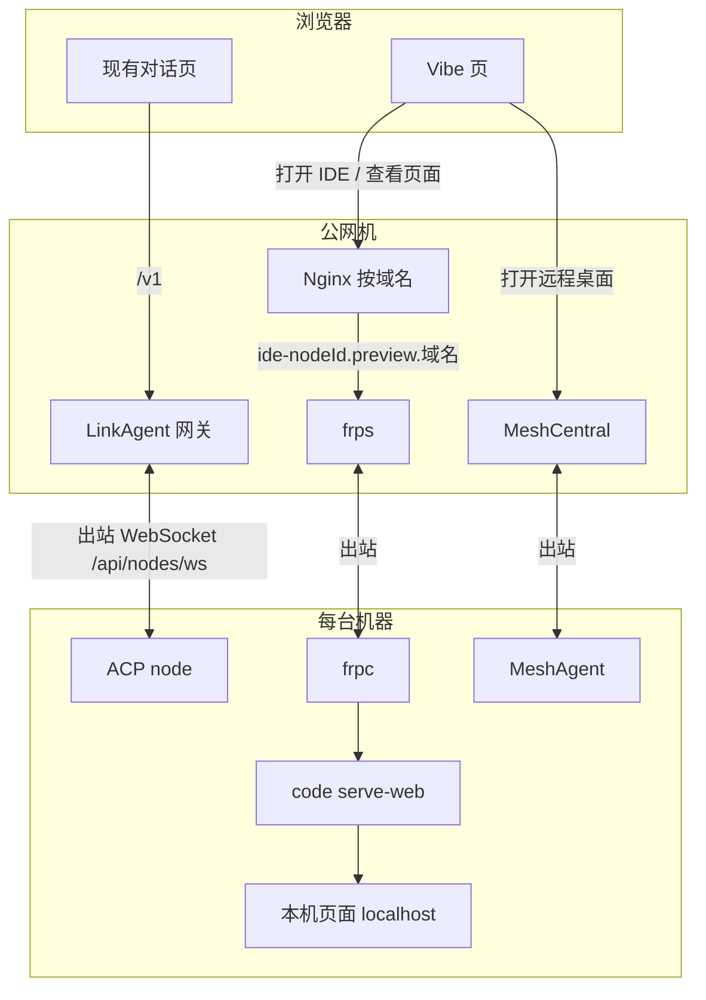
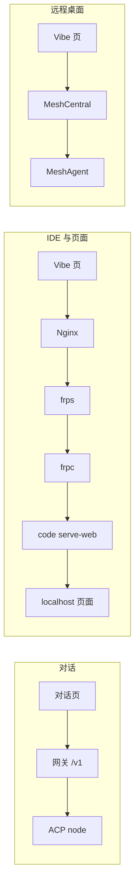
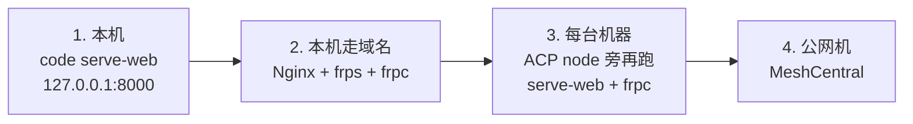

# Vibe Coding 系统架构

对话走现有 ACP node。IDE、文件树、页面预览走 Nginx + frp + `code serve-web`。远程桌面走 MeshCentral。三条链路互不替代。

## 目标架构

## 三条链路

| 链路 | 入口 | 节点上的进程 | 不经过 |
|---|---|---|---|
| 对话 | 现有网关 `/v1`、`/api/nodes/ws` | ACP node | frp、MeshCentral |
| IDE、文件树、页面预览 | `https://ide-{nodeId}.preview.<域名>` | `code serve-web` + frpc | ACP WebSocket、MeshCentral |
| 远程桌面 | MeshCentral | MeshAgent | frp |

页面预览用 VS Code Web 的 Ports，打开该节点上的 `localhost` 端口。Nginx 必须转发 `Host`，并打开 WebSocket。`code serve-web` 对外必须带 connection token，或由 Nginx 做登录校验。

## 从本机到云端

图的形状不变。先在本机跑通 IDE，再把公网入口装上，最后把同一套进程放到每台机器。

当前只完成第 1 步：本机 `code serve-web` 听 `http://127.0.0.1:8000`，工作区为仓库目录，未出公网。
