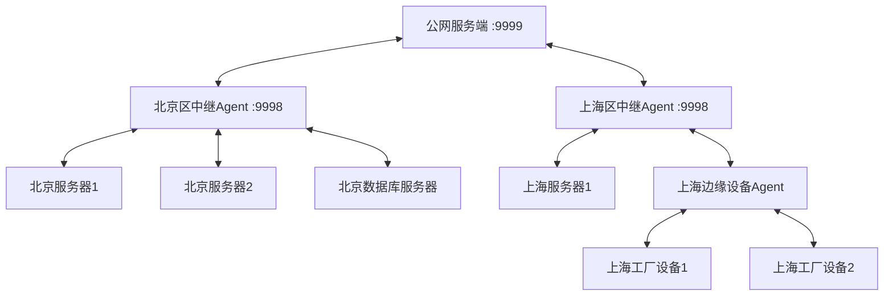

# VibeCoding - 轻量级远程运维平台

高性能、低侵入的跨平台远程运维工具，支持三大核心能力：**远程文件管理** + **进程/服务管理** + **远程桌面控制**，采用Agent/Server架构，全平台兼容。

## 功能特点
### ✅ 远程Agent运维能力
- **远程文件管理**：Agent端文件列表查看、上传、下载、删除、重命名、新建目录，支持大文件传输
- **远程进程/服务管理**：实时查看Agent端进程列表，结束指定进程，启动/停止系统服务，系统状态监控
- **远程桌面控制**：跨平台屏幕截图，支持鼠标/键盘事件转发

### ✅ 服务端内置功能
- **反向代理**：服务端内置HTTP/HTTPS/WebSocket反向代理，无需依赖外部nginx，支持路径重写
- **服务端本地文件管理**：服务端本身也提供文件管理API，可直接管理服务端本地文件，无需Agent
- **HTTP API**：所有能力都提供标准HTTP REST API，可直接集成到其他系统

### ✅ 架构特性
- **多级级联支持**：支持无限层级SubAgent树状拓扑，适合多层网络环境（内网、边缘设备、机房集群），子Agent无需直接访问公网
- 轻量级：Agent仅依赖Node.js，无额外运行库，单文件打包后仅10MB
- 安全：所有通信加密，内置Token鉴权，Agent主动外连，无需开放入站端口
- 多Agent管理：单服务端支持管理成千上万个Agent，支持拓扑可视化
- 低资源占用：Agent运行内存仅占用<50MB，CPU使用率<1%
- 易部署：只需部署一个服务端，Agent一键启动，自动注册到服务端

### ✅ 架构特性
- 轻量级：Agent仅依赖Node.js，无额外运行库，单文件打包后仅10MB
- 安全：所有通信加密，内置权限控制，Agent主动外连，无需开放入站端口
- 多Agent管理：单服务端支持管理成千上万个Agent
- 低资源占用：Agent运行内存仅占用<50MB，CPU使用率<1%
- 易部署：只需部署一个服务端，Agent一键启动，自动注册到服务端

## 架构
```
Web/CLI客户端 <---WebSocket---> VibeCoding Server <---WebSocket---> 远程Agent <---本地调用---> 操作系统
```

## 快速开始

### 1. 安装依赖
```bash
pnpm install
```

### 2. 启动服务端
```bash
# 开发模式
pnpm dev:server

# 生产模式
pnpm build && pnpm start:server
```
服务端默认监听端口`9999`，可通过环境变量`VIBECODING_PORT`修改。

### 3. 部署远程Agent
在需要管理的目标机器上部署Agent：
```bash
# 配置服务端地址
export VIBECODING_SERVER=ws://<your-server-ip>:9999
# 可选：自定义Agent ID和名称
export VIBECODING_AGENT_ID=my-macbook-pro
export VIBECODING_AGENT_NAME="我的MacBook Pro"

# 启动Agent
pnpm dev:agent
# 或生产模式
pnpm build && pnpm start:agent
```
Agent启动后会自动注册到服务端，无需手动配置。

### 4. 使用方式
#### 方式一：使用客户端SDK（WebSocket）
```typescript
import { VibeCodingClient } from './src/client/sdk';

// 连接服务端
const client = new VibeCodingClient('ws://127.0.0.1:9999');
await client.waitForConnect();

// 1. 获取所有在线Agent
const agents = await client.listAgents();
console.log('在线Agent:', agents);
const agentId = agents[0].agentId;
```

#### 方式二：使用HTTP API
##### 服务端文件管理API
```bash
# 获取文件列表
curl http://127.0.0.1:9999/api/file/list?path=/home

# 读取文件内容（base64编码）
curl http://127.0.0.1:9999/api/file/read?path=/home/test.txt

# 写入文件
curl -X POST http://127.0.0.1:9999/api/file/write \
  -H "Content-Type: application/json" \
  -d '{"path":"/home/test.txt","content":"SGVsbG8gV29ybGQh","encoding":"base64"}'

# 删除文件
curl -X POST http://127.0.0.1:9999/api/file/delete \
  -H "Content-Type: application/json" \
  -d '{"path":"/home/test.txt"}'

# 直接下载文件（浏览器可直接访问）
curl http://127.0.0.1:9999/file/home/test.txt -o test.txt
```

##### 反向代理配置示例
启动时配置代理规则，所有`/api/*`请求转发到后端服务：
```bash
export VIBECODING_PROXY_ENABLED=true
export VIBECODING_PROXY_RULES='[{"match":"/api","target":"http://127.0.0.1:8080","rewrite":true}]'
pnpm start:server
```
现在访问 `http://<server-ip>:9999/api/xxx` 会自动转发到 `http://127.0.0.1:8080/xxx`

// 2. 远程文件管理示例
// 列出目录
const files = await client.fileList(agentId, '/home/user');
console.log('文件列表:', files);

// 上传文件
const content = Buffer.from('Hello World!');
await client.fileWrite(agentId, '/home/user/test.txt', content);

// 下载文件
const downloadContent = await client.fileRead(agentId, '/home/user/test.txt');
console.log('文件内容:', Buffer.from(downloadContent, 'base64').toString());

// 3. 进程管理示例
// 查看进程列表
const processes = await client.processList(agentId);
console.log('进程数量:', processes.length);

// 查看系统状态
const status = await client.systemStatus(agentId);
console.log('CPU使用率:', status.cpu.usage + '%');
console.log('内存使用率:', status.memory.usage + '%');

// 4. 服务管理示例
// 列出服务
const services = await client.serviceList(agentId);
console.log('服务数量:', services.length);

// 5. 远程桌面示例
// 截图（返回base64编码的PNG）
const screenshotBase64 = await client.desktopScreenshot(agentId);
// 可以直接在前端用显示
require('fs').writeFileSync('screenshot.png', Buffer.from(screenshotBase64, 'base64'));
```

## 环境变量配置
### 服务端
| 变量名 | 说明 | 默认值 |
|--------|------|--------|
| `VIBECODING_PORT` | 服务端监听端口 | `9999` |
| `VIBECODING_HOST` | 服务端绑定地址 | `0.0.0.0` |
| `VIBECODING_AUTH_TOKEN` | API鉴权Token，空则不鉴权 | `` |
| `VIBECODING_PROXY_ENABLED` | 是否启用反向代理 | `false` |
| `VIBECODING_FILEMANAGER_ENABLED` | 是否启用服务端文件管理 | `true` |
| `VIBECODING_FILEMANAGER_ROOT` | 服务端文件管理根目录 | `./` |
| `VIBECODING_FILEMANAGER_ALLOW_WRITE` | 是否允许文件写入操作 | `true` |
| `VIBECODING_FILEMANAGER_ALLOW_DELETE` | 是否允许文件删除操作 | `true` |

### Agent端
| 变量名 | 说明 | 默认值 |
|--------|------|--------|
| `VIBECODING_SERVER` | 服务端/父Agent的WebSocket地址 | `ws://127.0.0.1:9999` |
| `VIBECODING_AGENT_ID` | Agent唯一ID | 自动生成 |
| `VIBECODING_AGENT_NAME` | Agent显示名称 | 主机名 |
| `VIBECODING_RELAY_ENABLED` | 是否开启中继模式，接收子Agent连接 | `false` |
| `VIBECODING_RELAY_PORT` | 中继模式下子Agent连接端口 | `9998` |

## 多级SubAgents级联部署方案
### 适用场景
- **多层内网环境**：公网服务端 → 网关层中继Agent → 内网业务区Agent → 边缘设备Agent
- **机房集群管理**：服务端部署在运维区，每个机柜部署一个中继Agent，机柜内所有服务器的Agent连接到本机柜中继Agent
- **跨区域管理**：每个区域部署一个中继Agent，区域内所有Agent连接到本区域中继，再统一连到总部服务端

### 部署示例


#### 步骤1：启动公网服务端
```bash
export VIBECODING_PORT=9999
pnpm start:server
```

#### 步骤2：启动北京区中继Agent
```bash
# 连接到公网服务端
export VIBECODING_SERVER=ws://<公网服务端IP>:9999
export VIBECODING_AGENT_NAME=北京区中继
# 开启中继模式，监听9998端口接收子Agent连接
export VIBECODING_RELAY_ENABLED=true
export VIBECODING_RELAY_PORT=9998
pnpm start:agent
```

#### 步骤3：启动北京区业务服务器Agent
```bash
# 连接到北京区中继Agent，不需要访问公网
export VIBECODING_SERVER=ws://<北京区中继IP>:9998
export VIBECODING_AGENT_NAME=北京业务服务器1
pnpm start:agent
```

#### 步骤4：查看拓扑结构
```bash
# HTTP API获取拓扑
curl http://<公网服务端IP>:9999/api/topology
```
返回树状结构，展示所有Agent的层级关系。

### 部署建议
1. **生产部署**：服务端可以部署在公网服务器，Agent部署在内网机器，无需开放任何入站端口，只需Agent能访问上层中继/服务端即可。
2. **安全加固**：生产环境建议在服务端前加Nginx反向代理，启用WSS（WebSocket over TLS）加密。
3. **Agent打包**：可以使用`pkg`或者`nexe`把Agent打包成单二进制文件，无需Node.js环境即可运行，方便部署到边缘设备。

## 后续版本规划
- [ ] 远程桌面鼠标/键盘事件支持
- [ ] 大文件断点续传
- [ ] 终端SSH功能
- [ ] Web管理后台
- [ ] 批量执行命令
- [ ] 定时任务管理
- [ ] 告警通知
